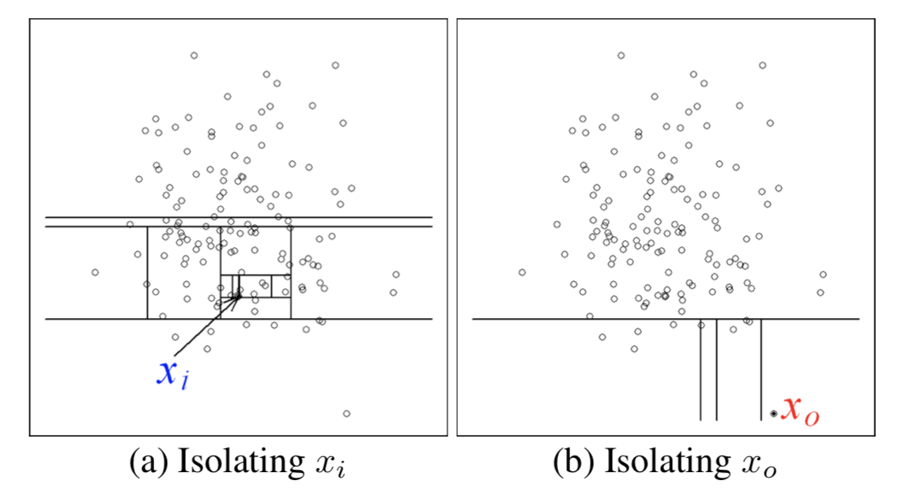

# Isolation Forest for Anomaly Detection
For this project, I implemented the original [Isolation Forest](https://cs.nju.edu.cn/zhouzh/zhouzh.files/publication/icdm08b.pdf) algorithm by Fei Tony Liu, Kai Ming Ting, and Zhi-Hua Zhou.1 The algorithm tackles the problem of anomaly detection by isolating anomalies with a forest of Isolation Trees. 

## Algorithm Overview
Isolation Trees are similar to Decision Trees in that they have a series of inner Decision Nodes that lead to external Leaf Nodes. Decision Nodes contain a split point on a particular feature, and Leaf Nodes contain a prediction for a given region. The difference between the two types of trees is in how the split points are chosen. The split points in a Decision Tree are picked such that they minimize a loss function, whereas the splits in an Isolation Tree are random. During training, each Isolation Tree is built by *randomly* splitting on one feature and value per Decision Node. Eventually, if we keep splitting on our data with no other stopping conditinos, we will isolate every point into it's own region.

The idea behind the algoithm is that **anomolies are "few and different"** and can therefore be **isolated with fewer random decision splits** than a normal observation.   

For example, in the picture above, point X0 was isolated into it's own region with only four splits, while point Xi took eleven splits to isolate.Therefore, X0 is *more* anomalous than Xi.   

After an Isolation Tree is built, the "number of splits" required to isolate a given point is measured by it's *Path Length*. For one tree, the path length of a point *x* is approximately the number of edges from the root node to the terminating node containing *x*.1 The point *x*'s *Anomaly Score* is the average of it's path length across all the trees in the forest, normalized by the size of the trees. 

## My Implementation
Inside this repo, you can find my implementation of Isolation Forest.
 
- [iforest](iforest/iforest.py): Source code for the algorithm; Isolation Forest, Isolation Trees, Path Length.
- [iforest\_sample_run](iforest/iforest_sample_run.ipynb): Application and visualization of Isolation Forest on a cancer diagnosis dataset.
- [plot_anomalies](iforest/plot_anomalies.py): Functions to help visualize the results of the Isolation Forest.2

----
#### References
1. Liu, Fei Tony, et al. “Isolation Forest.” 2008 Eighth IEEE International Conference on Data Mining, 2008, doi:10.1109/icdm.2008.17.
2. Parrt, Terrence. “Parrt/msds689.” GitHub, 2019, [github.com/parrt/msds689/blob/master/projects/iforest/plot_anomalies.py](github.com/parrt/msds689/blob/master/projects/iforest/plot_anomalies.py).
