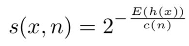
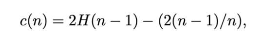

# Isolation Forest for Anomaly Detection
For this project, I implemented the original [Isolation Forest](https://cs.nju.edu.cn/zhouzh/zhouzh.files/publication/icdm08b.pdf) algorithm by Fei Tony Liu, Kai Ming Ting, and Zhi-Hua Zhou.1 The algorithm tackles the problem of anomaly detection by isolating anomalies with a forest of Isolation Trees. 

## Algorithm Overview
Isolation Trees are similar to Decision Trees in that they have a series of inner Decision Nodes that lead to external Leaf Nodes. Decision Nodes contain a split point on a particular feature, and Leaf Nodes contain a prediction for a given region. The difference between the two types of trees is how the split points are chosen. The split points in a Decision Tree are picked such that they minimize a loss function (e.g. MSE), whereas the splits in an Isolation Tree are random. During training, each Isolation Tree is built by *randomly* splitting on one value of one *random* feature per Decision Node. Eventually, if we keep splitting on our data with no other stopping conditions, every point will be *isolated* into its own region.

The idea behind the algorithm is that **anomalies are "few and different"** and can therefore be **isolated with fewer random decision splits** than a normal observation.   

	

For example, in the picture above, point X0 was isolated into its own region with only four random splits, while it took eleven random splits to isolate Xi. Therefore, X0 is *more* anomalous than Xi.   

After an Isolation Tree is built, the "number of splits" required to isolate a given point is measured by its *Path Length*. For one tree, the path length of a point *x* is approximately the number of edges from the root node to the terminating node containing *x*.1 Because the splits are random, *x*'s exact path length will vary from tree to tree, thus, we must aggregate the path lengths across all the trees. This aggregation for a single point *x* is called the *Anomaly Score*, and is equal to 2 to the negative power of (the average of its path length across all the trees in the forest / the size of the trees). 

	
	

This results in a score between 0 and 1 for every point. The higher the anomaly score (closer to 1), the more likely it is that the point is an anomaly.

### Downfalls and Improvements
One of the known weaknesses of the original isolation forest algorithm is that it can't handle lots of irrelevant or noisy features (columns).2 To handle this, I wrote an **improved** (set improved=True) version of the algorithm that chooses smarter splits during tree construction. Specifically, when making a split, rather than randomly choosing one feature and one value, it tries *multiple* random features/values at every decision node, and chooses the combination that yields the "best split." The best split is the split with the smallest left or right subregion — most isolation. Examples of IF with noisy data and the improved algorithm results can be found [here](iforest/iforest_sample_run.ipynb). 

## My Implementation
Inside this repo, you can find my implementation of Isolation Forest.
 
- [iforest](iforest/iforest.py): Source code for the algorithm; Isolation Forest, Isolation Trees, Path Length.
- [iforest\_sample_run](iforest/iforest_sample_run.ipynb): Application and visualization of Isolation Forest on a cancer diagnosis dataset.
- [plot_anomalies](iforest/plot_anomalies.py): Functions to help visualize the results of the Isolation Forest.2

----
#### References
1. Liu, Fei Tony, et al. “Isolation Forest.” 2008 Eighth IEEE International Conference on Data Mining, 2008, doi:10.1109/icdm.2008.17.
2. Parrt, Terrence. “Parrt/msds689.” GitHub, 2019, [github.com/parrt/msds689/blob/master/projects/iforest](https://github.com/parrt/msds689/blob/master/projects/iforest).
